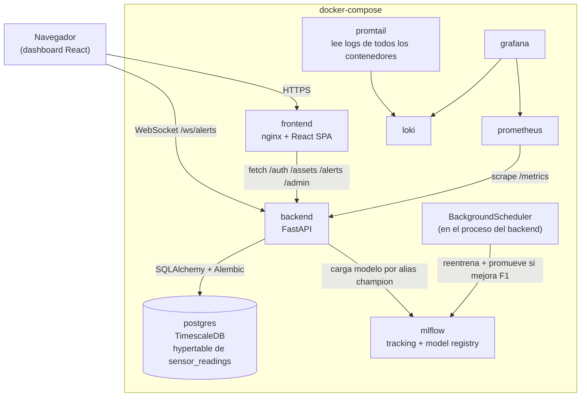

# Predictive Maintenance SaaS

[](https://github.com/jorgefong2408/predictive-maintenance-saas/actions/workflows/ci.yml)

Plataforma multi-tenant de mantenimiento predictivo: ingiere datos de sensores, detecta anomalías, predice la vida útil remanente (RUL) de activos industriales y presenta todo en un dashboard en tiempo real con alertas.

Este repositorio sigue el plan documentado en [`docs/PLAN.md`](docs/PLAN.md), ejecutado fase por fase (Semana 0 a Semana 10). Cada decisión de arquitectura no obvia tiene su porqué documentado en el propio código o en `docs/` — no es una lista de tecnologías, es un sistema que se puede levantar y probar de punta a punta hoy mismo con `docker compose up`.

## Arquitectura



Fuera del diagrama (corren aparte, no dentro de docker-compose): los pipelines de `ml/` (ingesta, EDA, entrenamiento, drift) se ejecutan bajo demanda con `uv run`, apuntando al mismo Postgres/MLflow cuando hace falta — no son servicios de larga duración.

## Estado actual

- [x] Semana 0 — Diseño (dataset, esquema de datos, estructura de repo, casos de uso)
- [x] Semanas 1-2 — Pipeline de datos (ingesta, EDA, esquema TimescaleDB, simulador tiempo real)
- [x] Semanas 3-4 — Modelado ML (baseline, Isolation Forest, XGBoost clasificación + RUL, MLflow) — ver [`docs/MODEL_RESULTS.md`](docs/MODEL_RESULTS.md)
- [x] Semana 5 — Backend / API (FastAPI, JWT multi-tenant, servicio de inferencia, Alembic, pytest)
- [x] Semana 6 — Frontend (React + Vite + TS + Tailwind, alertas en tiempo real por WebSocket)
- [x] Semana 7 — MLOps (drift con Evidently AI, reentrenamiento con promoción "champion", scheduler) — ver [`docs/MODEL_RESULTS.md`](docs/MODEL_RESULTS.md)
- [x] Semana 8 — Infraestructura (Docker, docker-compose con Postgres+TimescaleDB y MLflow reales, K8s, CI/CD) — despliegue a AWS pendiente de decisión del usuario, ver abajo
- [x] Semana 9 — Observabilidad (Prometheus+Grafana, Loki), prueba de carga con Locust, test e2e — ver [`load-testing/RESULTS.md`](load-testing/RESULTS.md)
- [x] Semana 10 — Documentación y pulido — video demo y deploy público pendientes de decisión del usuario, ver abajo

## Resultados

**Modelo** — comparado siempre contra un baseline explícito, no contra "nada" (detalle completo en [`docs/MODEL_RESULTS.md`](docs/MODEL_RESULTS.md)):

| | Baseline | Modelo final | Mejora |
|---|---|---|---|
| Clasificación de falla (AI4I 2020) — F1 | 0.000 (DummyClassifier) | **0.603** (XGBoost, ROC-AUC 0.975) | — |
| RUL (NASA C-MAPSS FD001) — RMSE | 20.75 ciclos (regresión lineal) | **17.06 ciclos** (XGBoost) | -28% error |

**Sistema** — bajo carga real con Locust, no solo "funciona en mi máquina" (detalle en [`load-testing/RESULTS.md`](load-testing/RESULTS.md)):

| | Antes | Después |
|---|---|---|
| Latencia mediana, endpoint de inferencia | 120 ms | **69 ms** |
| Throughput sostenido (20 usuarios concurrentes) | ~20 req/s, 0 fallos | ~21 req/s, 0 fallos |

**Producto** — UC1 completo, de punta a punta, en el navegador real: ingesta de lecturas → predicción de riesgo de falla (84.7%) vía el modelo real registrado en MLflow → estado del activo pasa a CRÍTICO → alerta aparece en la campana **sin recargar la página** (WebSocket) → se puede reconocer. Multi-tenancy (UC3) verificado: un segundo tenant recibe 404 al intentar ver el activo del primero.

## Datasets

| Fase | Dataset | Estado |
|---|---|---|
| MVP (clasificación de falla, baseline tabular) | [AI4I 2020 Predictive Maintenance (UCI)](https://archive.ics.uci.edu/dataset/601/ai4i+2020+predictive+maintenance+dataset) | Descargado en `ml/data/raw/ai4i2020.csv` |
| Fase avanzada (RUL, series temporales) | NASA C-MAPSS (Turbofan Engine Degradation) | Descargado y entrenado (`ml/pipelines/train_cmapss_rul.py`) |

## Estructura del repositorio

```
predictive-maintenance-saas/
├── backend/     # FastAPI + SQLAlchemy + Auth JWT multi-tenant + Dockerfile
├── ml/          # Notebooks, pipelines de entrenamiento, evaluación
├── frontend/    # React + Vite + TypeScript + Tailwind + Dockerfile (nginx)
├── infra/       # infra/sql (esquema TimescaleDB), infra/k8s (manifiestos)
├── docs/        # Plan, decisiones, esquema de datos, casos de uso
├── docker-compose.yml   # Postgres+TimescaleDB, MLflow, backend, frontend
└── .github/workflows/   # CI/CD (lint, test, build+push a ghcr.io)
```

## Stack

Ver [`docs/PLAN.md#5-stack-tecnológico-por-capa`](docs/PLAN.md) para el detalle completo por capa (datos/ML, backend, frontend, infraestructura).

## Cómo correr el proyecto (desarrollo local)

Gestión de dependencias con [`uv`](https://docs.astral.sh/uv/) (Python 3.12).

```bash
uv sync                                          # instala dependencias (grupo ml)
uv run python ml/pipelines/ingest_ai4i.py        # descarga -> ml/data/raw/ai4i2020.csv ya incluida
uv run jupyter notebook ml/notebooks/01_eda_ai4i2020.ipynb
uv run python ml/pipelines/simulate_realtime.py --speed 60 --limit 100
```

Carga a Postgres/TimescaleDB (requiere `infra/sql/001_schema.sql` aplicado y `DATABASE_URL` configurado, ver `.env.example`):

```bash
uv run python ml/pipelines/load_to_postgres.py
```

Hay dos formas de correr el resto del stack — misma base de código en ambas, cambia solo `DATABASE_URL`/`MLFLOW_TRACKING_URI`:

- **Sin Docker** (SQLite local, ver sección Backend abajo) — más rápido para iterar en el backend.
- **Con Docker** (`docker-compose.yml`, Postgres+TimescaleDB y MLflow reales) — ver "Semana 8" más abajo, es la que se probó de punta a punta.

### Backend (API) — sin Docker

Corre sobre SQLite local (`backend/predictmaint.db`, ignorado por git).

```bash
cd backend
uv run --project .. alembic upgrade head        # crea/actualiza el esquema (backend/alembic/)
uv run --project .. uvicorn app.main:app --reload --port 8000
```

Docs interactivos en `http://localhost:8000/docs`. Flujo mínimo: `POST /auth/register` (crea tenant + admin) → `POST /assets` → `POST /assets/{id}/readings` (5 sensores AI4I) → `POST /assets/{id}/predictions` (`failure_probability`, carga el modelo desde el Model Registry de MLflow y dispara una alerta si el riesgo es alto).

Tests (usan un SQLite temporal aislado, no tocan `predictmaint.db`; los de `/predictions` requieren haber corrido `train_ai4i_models.py` al menos una vez):

```bash
uv run pytest backend/tests -v
```

### Frontend (dashboard)

```bash
cd frontend
npm install
npm run dev          # http://localhost:5173 — espera el backend en :8000 (VITE_API_URL, ver .env.example)
```

Flujo de demo: `/register` (crea tenant + admin, UC3) → `/assets` (crear activo) → ingestar lecturas vía la API (`POST /assets/{id}/readings`, lo hace `ml/pipelines/simulate_realtime.py` en un flujo real) → abrir el activo → "Predecir riesgo de falla" dispara la inferencia real (MLflow) y, si el riesgo es alto, la alerta aparece en la campana **sin recargar la página** (WebSocket).

### MLOps (drift + reentrenamiento)

```bash
uv run python ml/pipelines/detect_drift.py     # ml/evaluation/drift_report.html + drift_summary.json
uv run python ml/pipelines/retrain.py          # nueva versión; promueve el alias "champion" solo si mejora el F1
```

El backend expone lo mismo por API (rol admin): `POST /admin/models/ai4i-failure-classifier/retrain` y `GET /admin/models/ai4i-failure-classifier/versions`. Un `BackgroundScheduler` interno corre el reentrenamiento cada `RETRAIN_INTERVAL_HOURS` (default 24h, ver `.env.example`) — el plan permite explícitamente "Celery beat *o cron*"; se optó por esto último para no sumar Redis sin un uso real todavía.

## Semana 8 — Infraestructura y despliegue

### Docker Compose (probado de punta a punta)

```bash
docker compose build
docker compose up -d
```

Levanta Postgres+TimescaleDB real (Alembic corre las migraciones al iniciar el backend, incluida la conversión a hypertable — ver `backend/alembic/versions/66036cd3183a_*.py`), un servidor MLflow real (no el sqlite embebido de desarrollo), el backend (`:8000`) y el frontend servido por nginx (`:5173`).

**Paso único tras el primer `up`:** el MLflow del contenedor arranca vacío — hay que sembrar el Model Registry corriendo el pipeline de entrenamiento contra él (una vez; igual que en cualquier entorno nuevo de MLOps):

```bash
MLFLOW_TRACKING_URI=http://localhost:5000 uv run python ml/pipelines/train_ai4i_models.py
MLFLOW_TRACKING_URI=http://localhost:5000 uv run python ml/pipelines/retrain.py   # fija el alias "champion"
```

Dos problemas reales que aparecieron al levantar esto por primera vez (documentados en `docker-compose.yml`):
1. **Versión de imagen de MLflow.** El cliente `mlflow` local es 3.16.x; un servidor 2.x no tiene los endpoints REST que ese cliente espera (`/api/2.0/mlflow/logged-models`) y falla con 404. La imagen del servicio `mlflow` debe coincidir con la versión del paquete `mlflow` en `pyproject.toml`.
2. **`default-artifact-root`.** Tiene que ser el esquema `mlflow-artifacts:/` (proxied a través del servidor por HTTP), no una ruta de archivo local — con una ruta local, cualquier cliente que no comparta el filesystem del contenedor de MLflow (ej. el backend, en su propio contenedor) falla al descargar el modelo con `No such artifact`.

### Kubernetes / CI-CD

- `.github/workflows/ci.yml`: lint + test (backend y frontend) en cada push/PR; build y push de imágenes a `ghcr.io` en `main`. El job de deploy a AWS existe como plantilla pero queda deshabilitado (`if: false`) — necesita credenciales de una cuenta real.
- `infra/k8s/`: manifiestos planos (Postgres, MLflow, backend, frontend, Ingress) con la misma topología que `docker-compose.yml`. **Escritos pero no aplicados contra ningún cluster** — ver [`infra/k8s/README.md`](infra/k8s/README.md) para los pasos pendientes y por qué.

## Semana 9 — Observabilidad y pruebas

Con `docker compose up -d` (Semana 8) también levantan:

- **Prometheus** (`:9090`) — scrapea `/metrics` del backend (vía `prometheus-fastapi-instrumentator`: latencia, throughput y tasa de error por endpoint).
- **Grafana** (`:3001`, sin login — anónimo habilitado solo para esta demo local) — dashboard "PredictMaint API - Overview" pre-provisto, datasources de Prometheus y Loki ya configurados.
- **Loki + Promtail** — logs centralizados de **todos** los contenedores del stack, leídos directamente del socket de Docker (sin instrumentar cada servicio); consultables desde Grafana → Explore → datasource Loki.

Prueba de carga con Locust sobre `POST /assets/{id}/predictions` (el endpoint de inferencia, no el CRUD alrededor):

```bash
uv run python -m locust -f load-testing/locustfile.py --host http://localhost:8000 \
  --headless -u 20 -r 5 -t 45s --csv load-testing/results
```

Encontró y corrigió un cuello de botella real (el servicio de inferencia resolvía la versión del modelo contra MLflow por red en cada request) y descartó dos hipótesis más sobre una cola de latencia p99 que persiste sin causa confirmada — ver el detalle completo, con números de antes/después, en [`load-testing/RESULTS.md`](load-testing/RESULTS.md).

Test end-to-end del flujo completo (`backend/tests/test_e2e_flow.py`): UC3 (alta de tenant) → UC4 (alta de activo) → UC1 (ingesta → predicción real vía MLflow → alerta automática → reconocimiento) → UC6 (trazabilidad), todo en una sola corrida — se suma a los tests unitarios/de integración existentes (`uv run pytest backend/tests -v`).

### Por qué no hay despliegue real a AWS

Requiere una cuenta de AWS del usuario, sus credenciales, y autorización explícita para el gasto que eso implica (EKS/ECS, Load Balancer, etc.) — no es algo que esta sesión deba decidir por su cuenta. Además, esta máquina ya tiene `kubectl` configurado contra un cluster EKS real de otro proyecto (`recomendaciones-cluster`); no se ejecutó ningún comando contra él.

## Semana 10 — Documentación y pulido

Este README (arquitectura, checklist por semana, resultados de modelo/sistema/producto), `docs/` (plan, esquema de datos, casos de uso, resultados de modelo detallados), `load-testing/RESULTS.md` y `infra/k8s/README.md` son la documentación final — no un documento aparte, para que no se desactualice del código. Licencia MIT (`LICENSE`) para dejar claro que el código es reusable como referencia de portafolio.

**Pendiente de decisión del usuario, no de esta sesión:**
- **Video demo (2-3 min):** requiere grabar pantalla, algo que esta sesión no puede hacer. Guion sugerido: (1) `docker compose up -d` levantando todo el stack, (2) registro de un tenant nuevo en el dashboard, (3) crear un activo e ingestar lecturas, (4) "Predecir riesgo de falla" → alerta apareciendo en vivo por WebSocket, (5) `GET /admin/models/.../versions` mostrando el historial en MLflow, (6) el dashboard de Grafana con métricas reales de la corrida de Locust.
- **Deploy público:** bloqueado por lo mismo que el despliegue a AWS de la Semana 8 — necesita una decisión explícita sobre cuenta/credenciales/gasto en la nube.

## Optimización y escalabilidad (post-plan)

Pasada de revisión sobre lo ya construido, buscando específicamente qué se rompería al escalar — no features nuevas. Cada punto es un hallazgo real, no una mejora especulativa.

**Bug real encontrado: reentrenamiento duplicado entre réplicas.** `infra/k8s/04-backend.yaml` corre 2 réplicas del backend, pero `BackgroundScheduler` (Semana 7) es un scheduler en memoria por proceso — sin coordinación, las dos réplicas reentrenarían por separado en cada tick. Fix: un advisory lock de Postgres (`pg_try_advisory_lock`) en `app/services/scheduler.py` — solo una réplica ejecuta el job en cada tick, sin sumar infraestructura nueva. Verificado con tests que mockean ambas ramas (lock adquirido / lock ocupado por otra réplica).

**Bug real encontrado: las alertas por WebSocket no cruzaban entre réplicas.** El `ConnectionManager` (Semana 6) solo conocía las conexiones de SU PROPIO proceso — con 2 réplicas, un cliente conectado a la réplica B nunca se enteraba de una alerta creada por la réplica A. Fix: Postgres LISTEN/NOTIFY (`app/services/ws_manager.py::PostgresListener`) — cada réplica escucha el mismo canal y reenvía a sus propios clientes locales; la que crea la alerta también se entera por la misma vía (ya no hay entrega "directa" en Postgres). **Verificado de verdad, no solo con mocks:** un listener externo (simulando una segunda réplica) recibió la notificación disparada por una predicción real contra el backend corriendo en Docker.

**Índices faltantes en las consultas que sí importan.** `alerts` y `predictions` no tenían índices más allá de la PK — pero *toda* consulta multi-tenant filtra por `tenant_id`/`asset_id`. Añadidos `ix_alerts_tenant_resolved`, `ix_alerts_asset_id`, `ix_predictions_asset_predicted_at` (migración `2da84ca336c5`), confirmados en el Postgres real vía `\di`.

**Paginación ausente en `/assets` y `/alerts`.** Ambos devolvían la tabla completa del tenant sin límite. Añadido `limit`/`offset` (default 100, tope 500) — no rompe al frontend actual (no manda esos params, usa el default) pero acota el peor caso a medida que crecen los datos.

**Frontend: bundle de 713KB en un solo chunk → dividido por ruta.** `AssetDetailPage` (con `recharts`, la dependencia más pesada) ahora es un `React.lazy` — solo se descarga cuando el usuario entra al detalle de un activo, no en la carga inicial de `/login`. `LoginPage`/`RegisterPage` quedaron en 2-3KB cada una.

**Frontend: un token vencido fallaba en silencio.** `RequireAuth` solo comprobaba que hubiera *algún* token, no que fuera válido — con uno vencido o de un `JWT_SECRET_KEY` distinto, la UI mostraba listas vacías sin explicación (lo noté probando a mano en la Semana 6). Fix: interceptor de respuesta en `lib/api.ts` que, ante un 401 en una petición autenticada, limpia el token y redirige a `/login`. Verificado corrompiendo el token a mano y confirmando la redirección.

**Corrección de dependencias:** `psycopg2-binary` lo usa el backend directamente (driver de Postgres) pero solo estaba declarado en el grupo `ml` de `pyproject.toml` — funcionaba porque ambos grupos se instalan juntos hoy, pero era información incorrecta.

## Seguridad (post-plan)

Segunda pasada de revisión, esta vez enfocada en bugs y seguridad. Cada punto se verificó contra el Postgres real de `docker-compose`, no solo con tests.

**Bug real: race condition en las migraciones de K8s.** `infra/k8s/04-backend.yaml` corre `alembic upgrade head` en un initContainer por réplica (2 réplicas) — si arrancan a la vez, dos migraciones concurrentes contra el mismo Postgres es una carrera real (Alembic no tiene locking propio). Fix: `backend/scripts/migrate_with_lock.py`, que serializa con un advisory lock de Postgres antes de correr la migración — mismo patrón que ya usaba el scheduler. **Verificado con Postgres real:** dos procesos compitiendo por el mismo lock se serializaron exactamente como se espera (el segundo esperó a que el primero soltara el lock, no hubo ejecución concurrente).

**Bug de seguridad real: sin rate limiting en `/auth/login`.** Nada impedía fuerza bruta sobre contraseñas. Fix: `login_attempts` (tabla nueva, persistida en Postgres — no en memoria, para que sea correcto entre réplicas), bloqueo de 15 min tras 5 intentos fallidos por email. En el camino apareció un bug de tz-aware/naive datetimes (`can't subtract offset-naive and offset-aware datetimes` en el segundo intento fallido) — SQLite no preserva tzinfo en el round-trip a la base aunque la columna se declare `timezone=True`; se normaliza a mano en vez de confiar en el tipo de columna.

**Bug de seguridad real: `JWT_SECRET_KEY=change-me` no se bloqueaba en ningún lado.** El sistema arrancaba igual de "producción" con el secreto default público (cualquiera que vea este repo lo conoce). Fix: `Settings` rechaza arrancar si `ENVIRONMENT=production` y el secreto sigue siendo uno de los valores default conocidos.

**Row-Level Security como defensa en profundidad — con un hallazgo serio en el camino.** Hasta acá, el aislamiento multi-tenant dependía 100% de que cada query recordara `.filter(tenant_id=...)`. Se agregaron políticas de RLS en Postgres (`tenant_id = NULLIF(current_setting('app.current_tenant_id', true), '')::uuid`, fail-closed si no está seteado) para que un query que lo olvide siga sin poder ver filas de otro tenant.

Al probarlo con SQL crudo contra el Postgres real — sin pasar por la API, exactamente el escenario que esto debía cubrir — **las políticas no protegían nada**: `predictmaint`, el rol con el que se conecta la app, resultó ser SUPERUSUARIO (así lo crea la imagen de TimescaleDB vía `POSTGRES_USER`), y un superusuario de Postgres salta RLS siempre, sin excepción, sin importar `FORCE ROW LEVEL SECURITY`. Sin este hallazgo, el código habría quedado *pareciendo* seguro sin estarlo.

Fix real: un segundo rol, `predictmaint_app` (migración `52dbcb3527ef`), sin superusuario y sin `BYPASSRLS`, con permisos de datos pero no de DDL — es el que ahora usa el backend en runtime (`DATABASE_URL`); las migraciones siguen corriendo con el rol admin (`MIGRATION_DATABASE_URL`). Un segundo bug apareció al conectar así: varias rutas hacen más de un `commit()` por request (insertar la predicción, después la alerta), y `set_config(..., true)` ("is_local", equivalente a `SET LOCAL`) se descarta en el primer commit — el segundo `db.refresh(...)` fallaba con `invalid input syntax for type uuid: ''`. Se cambió a `set_config(..., false)` (dura toda la sesión/conexión) con reset explícito al final del request.

**Verificación final, conectado como `predictmaint_app` (el rol real de producción), con SQL crudo que "olvida" el filtro de tenant:**

```
-- sin fijar el tenant:
SELECT name FROM assets;
 name
------
(0 rows)                          -- bloqueado, aunque la tabla tenga filas de sobra

-- con el tenant fijado:
SELECT set_config('app.current_tenant_id', '<id-tenant-A>', false);
SELECT name FROM assets;
   name
-----------
 AssetA2                          -- solo la fila de ese tenant, ninguna de otro
```

No se ejecutó nada de esto en el cluster EKS de otro proyecto detectado en la Semana 8 — solo contra el Postgres de `docker-compose`.
